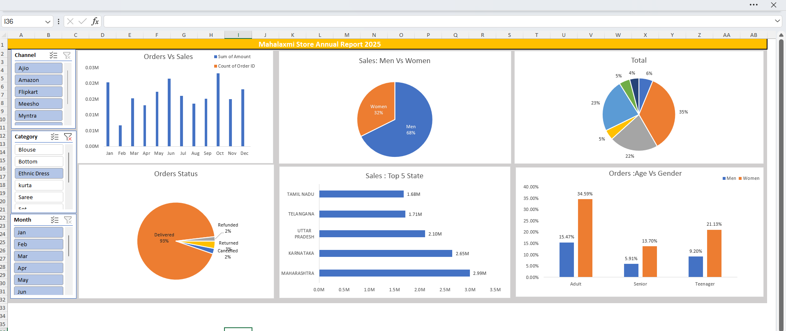

# 📊 Mahalaxmi Store Sales Dashboard 2025

## 📌 Project Overview

This project presents a sales analysis dashboard for Mahalaxmi Store. It helps in understanding customer behavior, sales trends, and overall business performance using Excel.

## 🛠 Tools Used

* Microsoft Excel
* Pivot Tables
* Pivot Charts
* Data Cleaning

## 📈 Key Insights

* Women contribute ~68% of total sales
* Adult age group (30–49 yrs) is the highest contributor
* Top states: Maharashtra, Karnataka, Uttar Pradesh
* 93% orders are successfully delivered
* Sales peak in October and June
* Few categories dominate sales, while others need improvement

## 🎯 Business Recommendations

* Focus on women customers (30–49 age group)
* Target top-performing states
* Increase marketing on Amazon, Flipkart, Myntra
* Improve low-performing categories with offers

## 📷 Dashboard Preview

## 👩‍💻 Author

Pragya Malviya
Aspiring Data Analyst
